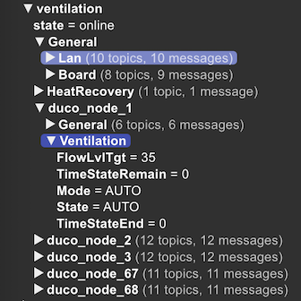

# duco2mqtt

Service that connects to the Duco Connectivity Board REST API and exposes the information to an mqtt server.
```
Usage: duco2mqtt [OPTIONS] --duco-host <DUCO_HOST> --mqtt-addr <MQTT_ADDR>

Options:
  -v, --verbose...                               Increase logging verbosity
  -q, --quiet...                                 Decrease logging verbosity
      --duco-host <DUCO_HOST>                    [env: D2M_DUCO_HOST=]
      --duco-ip <DUCO_IP>                        [env: D2M_DUCO_IP_ADDRESS=]
      --duco-poll-interval <DUCO_POLL_INTERVAL>  [env: D2M_POLL_INTERVAL=] [default: 60]
      --mqtt-addr <MQTT_ADDR>                    [env: D2M_MQTT_ADDRESS=]
      --mqtt-user <MQTT_USER>                    [env: D2M_MQTT_USER=]
      --mqtt-pass <MQTT_PASSWORD>                [env: D2M_MQTT_PASS=]
      --mqtt-port <MQTT_PORT>                    [env: D2M_MQTT_PORT=] [default: 1883]
      --mqtt-client-id <MQTT_CLIENT_ID>          [env: D2M_CLIENT_ID=] [default: duco2mqtt]
      --mqtt-base-topic <MQTT_BASE_TOPIC>        [env: D2M_MQTT_BASE_TOPIC=] [default: ventilation]
      --hass-discovery                           [env: D2M_HASS_DISCOVERY=]
      --certificate <CERTIFICATE>                [env: D2M_DUCO_CERTIFICATE=]
  -h, --help                                     Print help
```

To expose the variables to Home assistant so they are automatically detected, run with `--hass-discovery` or `D2M_HASS_DISCOVERY=true`.

For proper ssl verification download the certificate from the web interface of the Connectivity board and pass the path to the `--certificate` option or set `D2M_DUCO_CERTIFICATE=/path/to/cert.pem`. Otherwise the ssl connection will not be validated.


### Disclaimer
This version only supports the node types in my home setup. Feel free to provide a pull request for additional types.

### Build docker image
```
docker build -f docker/BuildDockerfile .
```
Prebuilt images are available at `dirkvdb/duco2mqtt`




